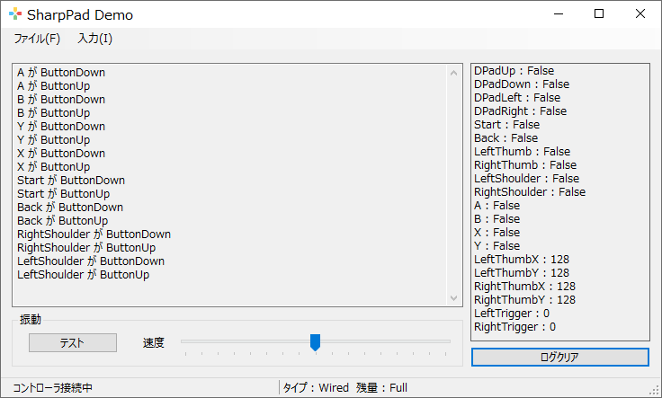

# SharpPad

## 概要

- XInput (XBox360用コントローラー規格)] のゲームパッドを制御するライブラリです。
- Logitech社の F310、F510 (販売終了)、F710 などが扱えます。

## 機能

- ボタン & アナログスティック入力状態検知。
- ボタンを押した時と離した時のイベント検知。
- ゲームパッドの接続イベント検知。
- ゲームパッドに対する振動命令機能など。

## インストール手順

1. リポジトリをクローン。

2. Visual Studio でソリューションを開いて、ビルド実行。

## 使い方

- SharpPad.Demo プロジェクトにサンプルコードが掲載されているので、参考にしてください。